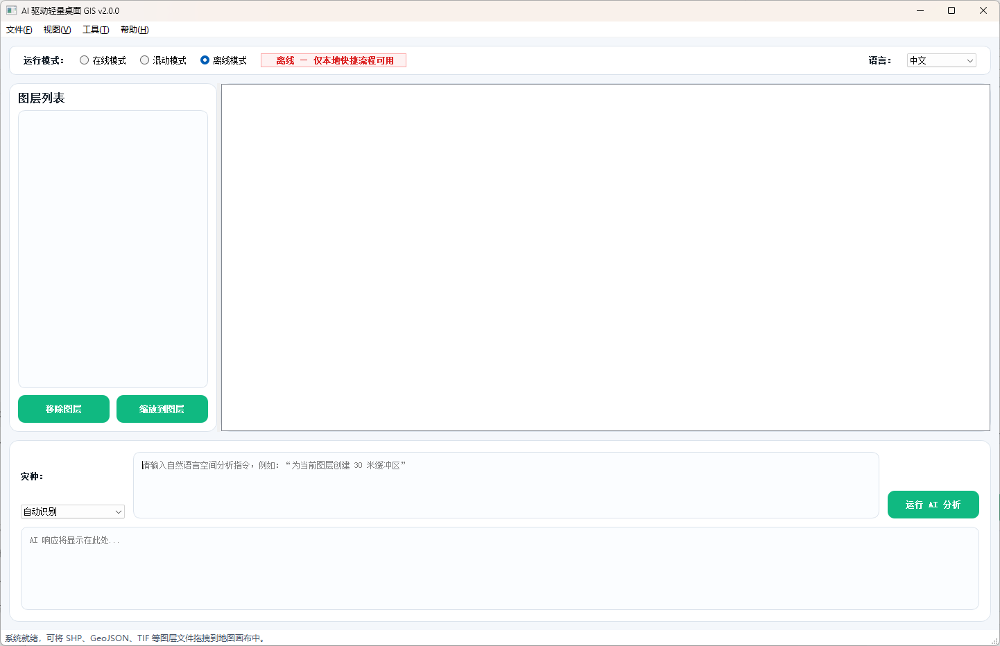
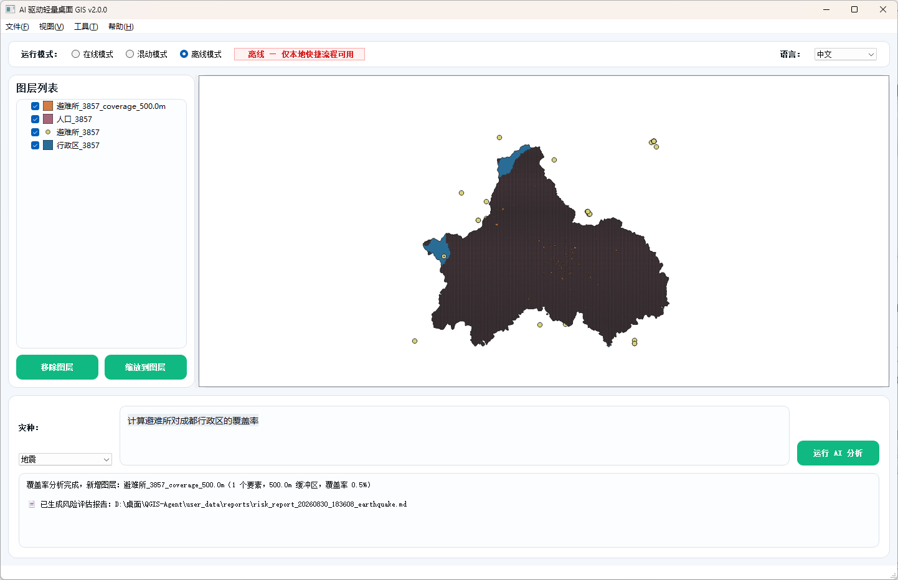

---
AIGC:
    Label: "1"
    ContentProducer: 001191440300708461136T1XGW3
    ProduceID: a024fff57185fad8e983aecfc0decd09_f2ad1af0a46411f193c6525400f8a581
    ReservedCode1: SrsnZwEEOqgf7Pn6215H96LsFqOrUmmL+GjUWf33cp4e93TLixQRRcTZkYMJhQflHvMWkks5WSidopz9hfdeFDHNyTOgxvzQEhj/RSi+6wQ5WyRNh9kx3GeqYFSiWZ+TXhthnWdns6nCKO0v/oEn3x8UsUso42scXeuHfs3EnEnU4dzJQOgPuIhoi+s=
    ContentPropagator: 001191440300708461136T1XGW3
    PropagateID: a024fff57185fad8e983aecfc0decd09_f2ad1af0a46411f193c6525400f8a581
    ReservedCode2: SrsnZwEEOqgf7Pn6215H96LsFqOrUmmL+GjUWf33cp4e93TLixQRRcTZkYMJhQflHvMWkks5WSidopz9hfdeFDHNyTOgxvzQEhj/RSi+6wQ5WyRNh9kx3GeqYFSiWZ+TXhthnWdns6nCKO0v/oEn3x8UsUso42scXeuHfs3EnEnU4dzJQOgPuIhoi+s=
---

# QGIS-Agent v2.0.0 — 多灾种快速评估 + 自然语言驱动的桌面 GIS 智能助手

> 说一句话，完成 GIS 分析。无需安装 QGIS，双击即用。

## 界面预览

<p align="center">
  
  
</p>


[](https://github.com/kongchenxu792-cell/QGIS-Agent)

---


## ⚠️ 重要：GitHub 仓库不含 QGIS 引擎

本仓库仅托管源代码（约 2 MB）。QGIS 便携引擎（`qgis-portable/`，瘦身后约 1.51 GB）不进入版本库，改由 GitHub Release 分发（压缩包约 526 MB）。**全新环境首次运行时会自动下载并解压引擎**，无需手动安装。

### 如何获得完整可运行版本

**方式一：首次运行自动下载引擎（推荐，全新环境）**

1. `git clone https://github.com/kongchenxu792-cell/QGIS-Agent.git`
2. 运行 `启动_静默.py`（或双击桌面快捷方式）
3. 首次启动检测到 `qgis-portable/` 缺失，自动从 Release 下载 `qgis-engine-2.0.0.zip`（约 526 MB）、校验 SHA256 后解压
4. 引擎就绪后自动进入主程序

**方式二：从已有环境直接复制（最快）**

如果你已经在某台电脑上成功运行过 QGIS-Agent，直接把整个项目文件夹复制到目标电脑即可。`qgis-portable/` 是绿色版，不依赖注册表。

**方式三：手动下载引擎（可选）**

前往 [Releases](https://github.com/kongchenxu792-cell/QGIS-Agent/releases/tag/engine-2.0.0) 手动下载 `qgis-engine-2.0.0.zip`，解压到项目根目录，得到如下结构后即可运行：

   ```
   QGIS-Agent/
   ├── 启动.bat
   ├── 启动_静默.py
   ├── src/
   └── qgis-portable/       ← 解压后放这里
       ├── bin/
       ├── apps/
       │   ├── qgis-ltr/
       │   ├── Qt5/
       │   └── Python312/
       └── share/
   ```

### 路径注意事项

| 路径示例 | 是否可用 | 原因 |
|----------|---------|------|
| `D:\QGIS-Agent` | ✅ 可用 | 纯英文，无空格 |
| `C:\Users\用户名\桌面\QGIS-Agent` | ✅ 可用 | 中文用户名不影响 |
| `D:\新建文件夹 (17)\QGIS-Agent` | ❌ 不可用 | 中文路径 + 括号 → PROJ/GDAL 初始化失败 |
| `D:\My Projects\QGIS-Agent` | ❌ 不可用 | 空格路径 → Python DLL 加载可能失败 |

**如果出现 `ImportError: DLL load failed`**，说明路径有问题或有多个 Python 版本冲突。检查：
- 项目路径是否含中文或空格
- 本机是否同时安装了系统版 QGIS 或独立 Python（会与便携版冲突）
- 是否缺少 [VC++ Redistributable 2015-2022](https://aka.ms/vs/17/release/vc_redist.x64.exe)
## 快速开始

### 5 分钟上手

1. **克隆仓库**：`git clone https://github.com/kongchenxu792-cell/QGIS-Agent.git`
2. **运行 `启动_静默.py`**（或双击桌面快捷方式），首次启动会自动下载引擎（约 526 MB）并解压
3. 等待 QGIS 界面加载后，在底部对话框中输入指令，回车执行

**无需安装 QGIS**——QGIS 3.44 便携引擎（约 1.51 GB）会在首次运行时自动下载解压。

### 在线模式（推荐首次体验）

1. 首次启动会弹出 API Key 输入窗口
2. 填入你的阿里云百炼 API Key（免费申请：https://bailian.aliyun.com）
3. 保存后即可使用

### 离线模式（数据完全本地）

1. 安装 [Ollama](https://ollama.com/download/windows)
2. 拉取模型：`ollama pull qwen3.5-4b`
3. 在 QGIS-Agent 顶部切换到「离线模式」即可

> 离线模式无需联网，无需 API Key，所有数据不出本机。离线链路走 Ollama `/api/chat`（num_ctx 4096，expect_json 自动重试），灾种识别率 96%。

---

## 核心能力

### 日常 GIS 操作（22 条自然语言指令）

支持中文/日文/英文三语输入，覆盖图层管理、样式设置、要素编辑、属性导出、缓冲区分析等。

| 类别 | 示例指令 |
|------|---------|
| 图层管理 | "加载 D:\data\points.shp"、"移除学校图层"、"列出所有图层" |
| 样式设置 | "按面积字段分级渲染"、"加载 style.qml"、"显示标注" |
| 数据分析 | "导出属性表为 CSV"、"统计面积字段"、"创建 500 米缓冲区" |
| 地图操作 | "放大"、"缩放到学校图层"、"导出地图为 PNG" |
| 要素操作 | "选择面积大于 100 的要素"、"点击查询属性"、"过滤城市字段为北京" |

### 地震灾害自动化分析（5 条专业链路）

这是 QGIS-Agent 区别于通用 GIS 工具的核心能力——将日本内阁府防灾标准业务流自动化。

| 分析链路 | 输入 | 输出 | 应用场景 |
|---------|------|------|---------|
| **空间关联** | 震度分布图 + POI 设施 | 受影响设施清单 | 震后初动——识别影响范围内的关键设施 |
| **覆盖分析** | 避难所点位 + 行政区边界 | 覆盖率 % + 盲区地图 | 验证避难所配置是否满足防灾计划要求 |
| **盲区分析** | 覆盖分析结果 | 未覆盖区域地图 | 定位避难所服务空白区域 |
| **人口覆盖** | 覆盖区域 + 人口分布 | 人口覆盖 %（面积 vs 人口） | 证伪"面积可替代人口"——发现 32.7% 面积覆盖 vs 56.0% 人口覆盖 |
| **建筑风险** | 震度分布 + 人口 + 建筑数据 | 受灾暴露人口 + 建筑风险指数 | 震度 × 人口叠置估算受灾人口规模 |

**政策依据**：日本内阁府令和 8 年 6 月 12 日阁议决定《首都直下地震紧急对策推进基本计划》规定——都心南部直下地震想定死者最大约 1.8 万人、建筑全坏烧失约 40 万栋，今后 10 年间半减为减灾目标。本工具为该计划要求的「膨大な人的・物的被害への対応強化」提供自动化基础分析。

### 多灾种快速评估（可插拔注册 + 一键报告）

在单一地震链路之上，新增**多灾种注册表**驱动的快速评估能力，灾种可插拔扩展，引擎零改动。

- **多灾种注册表**（`src/core/disaster_registry.py`）：以注册表条目描述灾种的数据目录、模板、预警阈值等，新增灾种只需注册条目，无需改引擎 / Guards / 模板 / CRS 逻辑。当前内置日本 4 灾种 + 中国成都（`chengdu`，country=CN，data_dir 条目级覆盖）。
- **多灾种可插拔，验证范围如实标注**：地震 / 滑坡 / 火灾 = 合成数据验证；洪涝 = 成都真实河流数据（buffer 近似）+ 合成数据双重验证；通用覆盖链（避难所对行政区覆盖率）= 成都真实数据（37 / 1284 点）验证。合成灾种仅验证链路可行性，真实洪涝验证真实地理数据接入。
- **灾种下拉 + 自然语言**：界面通过灾种下拉锁定评估对象，同时支持自然语言指令，经 LLM 识别后走同一条确定性管道。
- **一键风险评估报告**（`src/core/report_generator.py`）：评估完成后自动生成 `user_data/reports/risk_report_*.md`，并触发**阈值预警**（如覆盖率低于预警阈值 50% 时给出布点核查建议）。
- **run 记录**（`src/core/run_queue.py` + `output/.../run_record.json`）：每次运行自动留痕，记录数据源、链路参数、统计结果、报告路径与审计结论，全程可追溯。

### 中国真实数据验证（成都，双口径）

用中国真实数据（成都：行政区 / 人口格网 19365，EPSG:3857，半径 500m）跑通三链，全部 PASS 并触发预警。采用双口径验证：
- 口径 A：37 点官方挂牌避难所（scdata 应急厅，最高可信度）
- 口径 B：1284 点（37 官方 + 1247 OSM 学校/公园/运动场潜在载体）

| 指标 | 口径 A（37 点官方） | 口径 B（1284 点含潜在载体） | 状态 |
|------|------|------|------|
| 覆盖率 | 0.144% | 4.12% | 成功 |
| 盲区率 | 99.86% | 95.88% | 成功 |
| 人口覆盖率 | 1.41% | 27.27% | 成功 |

- 独立复算覆盖面积 vs 引擎：两口径相对偏差均 **0.0000%**（容差 ±1%）→ PASS
- 一致性校验（gap_rate vs 100-coverage_rate）：两口径偏差均 **0.0000%** → PASS
- 预警：口径 A「成都」危险区覆盖率仅为 0.14%，口径 B 为 4.12%，均低于预警阈值 50.00%，建议核查避难所布点
- 双口径意义：口径 A（挂牌 0.14%）展示可信下限（官方挂牌数据，置信度最高）；口径 B（含潜在载体 4.12%）展示容量评估视角（学校/公园/运动场等潜在避难场所，依据国家标准）
- 注册表新增 `chengdu` 条目，现有 4 灾种零改动；引擎 / Guards / 模板 / CRS 零改动
- 跑通脚本：`scripts/run_chengdu_dual.py`；双口径对照表：`output/成都双口径/双口径对照表.md`；运行记录：`output/成都双口径/run_record.json`；CEO 实测复现（真实 UI）：[ceo_ui_final_20260831_170141.png](output/成都双口径/CEO_UI复现/ceo_ui_final_20260831_170141.png)

> 更多落地证据见 [docs/e2e_acceptance_plan.md](docs/e2e_acceptance_plan.md) 验收计划与 [output/落地证明包](output/落地证明包) 证明包。

### 中国真实洪涝验证（成都，河流 buffer 近似）

用成都真实河流水系（5122 条，EPSG:3857）生成洪涝淹没区近似：河流 buffer 300m（Shapely，几何 valid 断言）→ 淹没区面图层（`output/成都洪涝/淹没区_3857.gpkg`，source=河流buffer近似）。以该淹没区作为洪涝危险区，评估避难所（37 点官方口径 A）500m 缓冲覆盖率：

| 指标 | 结果 | 状态 |
|------|------|------|
| 淹没区面积（河流 buffer 300m 近似） | 6180759065 m² | 生成 |
| 洪涝覆盖率（37 点避难所 500m 缓冲） | 0.1465% | 成功 |
| 覆盖面积 | 9055286 m² | 成功 |

- 独立复算覆盖面积 vs 引擎：相对偏差 **0.0000%**（容差 ±1%）→ PASS
- 报告预警：覆盖率 0.15% 低于预警阈值 50.00%，建议核查避难所布点
- 生成脚本：`scripts/chengdu_flood_gen.py`；运行记录：`output/成都洪涝/run_record.json`；说明：`output/成都洪涝/SOURCE.md`
- 注意：该淹没区为河流 buffer 近似示意（非水文模型结果），仅用于覆盖分析演示；多灾种验证范围如实标注见上文

### 架构特色

```
用户输入（自然语言 / 灾种下拉）
    │
    ▼
灾种下拉（注册表可插拔）──► AI 意图识别（在线 Qwen-Plus / 离线 Qwen3.5-4B）
    │
    ▼
{action, params} JSON ───→ InstructionMapper.match_and_execute()
    │
    ▼
Guard 检查（CRS / 图层类型 / 参数有效性）
    │
    ▼
Pipeline 确定性执行（8 步引擎 + Shapely fallback 全链路）
    │
    ▼
结果输出（覆盖率 / 图层 / CSV / 可追溯日志）
    │
    ▼
一键风险评估报告 + 阈值预警（risk_report_*.md + run_record.json）
```

- **AI 只负责理解意图和填参数，不碰实际计算**——在线和离线走同一条确定性管道，灾种识别由注册表 + LLM 双确认
- **多灾种可插拔**——注册表驱动，新增灾种不改引擎 / Guards / 模板
- **CRS 自动检测和修正**——地理坐标系（度）下自动拦截，避免缓冲区算出错误结果
- **Shapely 全链路 fallback**——QGIS 大坐标处理异常时自动降级到 Shapely 引擎
- **Pipeline 中途失败自动回滚**——不会留下半成品中间图层
- **一键报告 + 阈值预警**——评估结果自动沉淀为报告并触发阈值预警

---

## 项目结构

```
QGIS-Agent/
├── 启动.bat                    # 一键启动脚本
├── 启动_静默.py                # 无控制台启动 + 首次运行自动下载引擎
├── qgis-portable/              # QGIS 3.44.9 便携引擎（~1.51 GB，首次运行自动下载）
├── src/
│   ├── main.py                 # 程序入口
│   ├── __init__.py             # 版本号（v2.0.0）
│   ├── core/
│   │   ├── ai_worker.py        # AI 推理调度（在线/离线双模式 + exec 已被移除）
│   │   ├── instruction_mapper.py # 指令映射 + 参数校验 + 图层名修正
│   │   ├── pipeline_executor.py  # Pipeline 确定性执行引擎（6 引擎 + fallback）
│   │   ├── guards.py           # Guard 注册表（CRS/图层类型/参数有效性 9 个守卫）
│   │   ├── handlers_analysis.py  # 分析 Handler（覆盖/盲区/人口/建筑风险）
│   │   ├── handlers_basic.py   # 基础 Handler（加载/导出/缓冲/空间连接等 20 个）
│   │   ├── handlers_seismic.py # 地震 Handler（震度态势图）
│   │   ├── template_registry.py  # Template 注册表 + 图层自动识别
│   │   ├── templates/          # 4 个 JSON Pipeline 模板
│   │   │   ├── coverage_analysis.json
│   │   │   ├── gap_analysis.json
│   │   │   ├── population_coverage.json
│   │   │   └── building_risk.json
│   │   ├── disaster_registry.py  # 多灾种注册表（可插拔，日本 4 灾种 + 成都）
│   │   ├── report_generator.py   # 一键风险评估报告 + 阈值预警
│   │   ├── run_queue.py          # run 记录（run_record.json 留痕）
│   │   ├── result_contract.py    # 结果契约（统计/报告/预警统一结构）
│   │   ├── output_persistence.py # 结果持久化
│   │   ├── offline_workflows.py  # 离线工作流（Ollama /api/chat 链路）
│   │   ├── sandbox_worker.py   # 沙箱执行引擎（已封存，保留备审计）
│   │   ├── fallback_utils.py   # Shapely 全链路 fallback（大坐标兜底）
│   │   ├── qgis_env.py         # QGIS 便携环境引导
│   │   ├── config_manager.py   # 配置持久化（aiqgis_config.json）
│   │   ├── ai_config.py        # AI 端点配置
│   │   ├── local_llm.py        # Ollama 推理客户端
│   │   ├── memory_bridge.py    # 对话记忆桥接（mem0 集成）
│   │   └── ...
│   ├── skills/                 # Skill 系统（16 个独立技能模块）
│   ├── prompt_agent/           # 提示词调试工具
│   ├── i18n/                   # 中/日/英三语（各 219 键）
│   └── ui/                     # PyQt5 界面层
├── scripts/
│   ├── run_chengdu.py          # 成都三链跑通脚本（早期 39 点）
│   ├── run_chengdu_dual.py     # 成都双口径跑通脚本（37 官方 / 1284 含潜在载体）
│   ├── multi_disaster_llm.py   # 多灾种 LLM 全链验证
│   ├── proof_of_run.py         # 运行留痕证明
│   └── ...
├── tests/                      # 180 个单元测试 + 20 subtests
├── docs/
│   ├── e2e_acceptance_plan.md  # 端到端验收计划
│   └── ...
└── output/
    ├── 成都双口径/             # 双口径对照表 + run_record.json + CEO 复现证据
    ├── 片A补充_LLM全链验证/
    ├── 落地证明包/             # 落地证明包
    └── ...
```

---

## 技术栈

| 层级 | 技术 |
|------|------|
| GUI | PyQt5 |
| GIS 引擎 | QGIS 3.44 (PyQGIS) |
| 几何计算 | Shapely 2.x（全链路 fallback） |
| 在线 AI | 阿里云 DashScope Qwen-Plus |
| 离线 AI | Ollama + Qwen3.5-4B（/api/chat，num_ctx 4096，expect_json 重试，识别率 96%） |
| 多灾种 | disaster_registry 注册表（可插拔） |
| 指令解析 | JSON 模板匹配 + keyword 纠偏 + 三层容错 |
| 国际化 | 中文 / 日文 / English（219 键完全对齐） |
| 测试 | pytest（180 用例 + 20 subtests，全量 206+20） |

---

## 测试

```batch
# 一键运行全部测试（需要 portable QGIS 环境）
tests\run_tests.bat -v

# 预期输出：180 passed + 20 subtests（全量 206+20）
```

---

## 验收与落地证明

- **端到端验收计划**：[docs/e2e_acceptance_plan.md](docs/e2e_acceptance_plan.md)
- **落地证明包**：[output/落地证明包](output/落地证明包)
- **中国真实数据验证（成都双口径）**：[output/成都双口径/双口径对照表.md](output/成都双口径/双口径对照表.md)

---

## 注意事项

- **仅支持 Windows 10/11 64-bit**
- **不建议放在中文路径下**（可能导致 PROJ/GDAL 初始化失败）
- 离线模式需 8 GB 以上内存/显存
- 在线模式首次启动会提示配置 API Key

---

## 许可证

本项目采用 [MIT License](https://opensource.org/licenses/MIT)。

致谢：[QGIS](https://qgis.org/) · [Ollama](https://ollama.com/) · [Qwen](https://github.com/QwenLM/Qwen) · [阿里云百炼](https://bailian.aliyun.com/) · [Shapely](https://shapely.readthedocs.io/)

---

## 联系方式

- **作者**：kongchenxu792
- **邮箱**：kongchenxu792@gmail.com
- **仓库**：[github.com/kongchenxu792-cell/QGIS-Agent](https://github.com/kongchenxu792-cell/QGIS-Agent)
*（内容由AI生成，仅供参考）*
